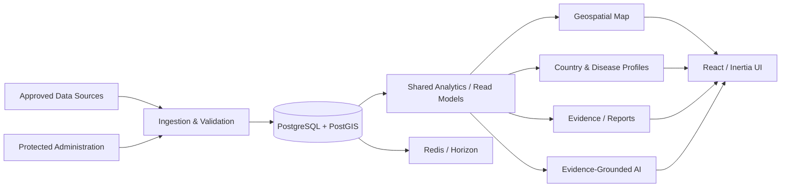

# GALVmed — Disease Intelligence & Evidence Platform

## Overview

GALVmed Disease Intelligence is a source-transparent data-intelligence platform for livestock disease information across Africa.

The platform combines structured evidence, geospatial data, analytical dashboards, country and disease profiles, controlled public discovery, reporting, and AI-assisted intelligence workflows while keeping source provenance and evidence boundaries visible to the user.

From an engineering perspective, the project demonstrates a broader pattern that applies well beyond animal health: turning heterogeneous source data into reliable, explainable, searchable, and decision-supporting intelligence.

## Product Problem

Decision-makers often work with disease information spread across reports, source files, official publications, and historical records. Without a common data model and provenance rules, analysis can become inconsistent and difficult to verify.

The platform was designed to provide:

- structured evidence ingestion
- a shared analytical model
- geospatial intelligence
- source provenance and transparency
- controlled public profiles and discovery
- dashboards and downloadable evidence
- protected administration workflows
- AI-assisted analysis that remains grounded in evidence

## Architecture

## Core Capabilities

### Geospatial Intelligence

Disease evidence can be explored through controlled geographic views using PostgreSQL/PostGIS with map-focused frontend tooling.

Stored spatial data uses explicit coordinate and geometry conventions so analytical and map behavior can be tested rather than inferred.

### Shared Analytical Contracts

Country profiles, disease profiles, the public dashboard, map views, and evidence lists are designed to share validated filters and read models instead of recomputing metrics independently.

This reduces the risk of the same dataset producing conflicting numbers across different screens.

### Evidence Provenance

The platform treats source transparency as part of the product. Public evidence records retain stable identifiers and source-grain context so users can understand what a displayed record represents.

### Controlled Public Discovery

Users can navigate through approved country and disease directories, search controlled entities, apply analytical filters, and share canonical filtered views.

### Protected Administration

Public analytical surfaces are separated from protected administration and data-management workflows.

### Evidence-Grounded AI

AI-assisted workflows are designed around approved evidence and controlled outputs rather than treating generated text as a source of truth.

## Engineering Scope

- Data ingestion and normalization
- Source provenance and evidence modeling
- PostgreSQL / PostGIS geospatial data design
- Public analytical dashboards
- Country and disease intelligence profiles
- Map-based exploration
- Shared filtering and read-model contracts
- Evidence record pages and exports
- Protected administration and RBAC
- Background queues and scheduled processing
- Dockerized development and production-oriented runtime
- Testing, static analysis, frontend verification, and CI-aligned quality gates
- AI-assisted investigation and reporting workflows

## Technology

**Backend:** Laravel 12 · PHP 8.4  
**Frontend:** React 19 · TypeScript · Inertia.js · Tailwind CSS  
**Database:** PostgreSQL 17 · PostGIS 3.5  
**Queue / Cache:** Redis 7 · Laravel Horizon  
**Maps / Visualization:** MapLibre GL · deck.gl · Recharts  
**Authorization:** Spatie Laravel Permission  
**Testing & Quality:** Pest · Larastan · Pint · Vitest · Playwright  
**Infrastructure:** Docker Compose · Nginx · PHP-FPM · scheduler / worker services

## Engineering Decisions

### One Analytical Definition Across Surfaces

Metrics and filters are centralized in shared analytical contracts so the map, profiles, lists, and dashboards do not silently invent different interpretations of the same data.

### Provenance Before Prediction

The initial product boundary prioritizes official evidence, historical intelligence, and traceability. The system avoids presenting unsupported predictive or clinical claims as established facts.

### Geospatial Semantics Are Explicit

Coordinate systems, geometry types, indexing, and latitude/longitude ordering are treated as testable engineering rules because spatial mistakes can silently produce misleading outputs.

### Public Evidence Has Stable Identity

Public evidence records use stable public identifiers rather than leaking internal database keys or deriving identifiers from sensitive source content.

### AI Is Decision Support, Not Authority

AI features operate inside evidence and governance boundaries. Human review and source evidence remain authoritative.

## My Role

My work on the platform spans:

- Product and technical architecture
- Data-intelligence workflow design
- Data model and provenance architecture
- Geospatial system design
- Full-stack implementation direction
- Dashboard and analytical workflow design
- AI-assisted analysis and reporting architecture
- Infrastructure and containerized environment design
- Engineering quality, testing, review, and delivery decisions
- AI-assisted development with human ownership of architecture and validation

## Transferable Engineering Value

Although the domain is animal-health intelligence, the underlying engineering patterns are directly applicable to many data-heavy products:

- market intelligence
- operational dashboards
- portfolio and asset intelligence
- geographic analytics
- compliance and evidence systems
- research and decision-support platforms

The core problem is the same: combine multiple data sources into a trustworthy analytical product without losing provenance or consistency.

## Source Code & Privacy

The production source code is maintained in a **private repository** and is intentionally not published here.

This case study contains only high-level, non-sensitive product and engineering information. It does not expose credentials, private source data, customer information, internal configuration, or proprietary implementation code.
