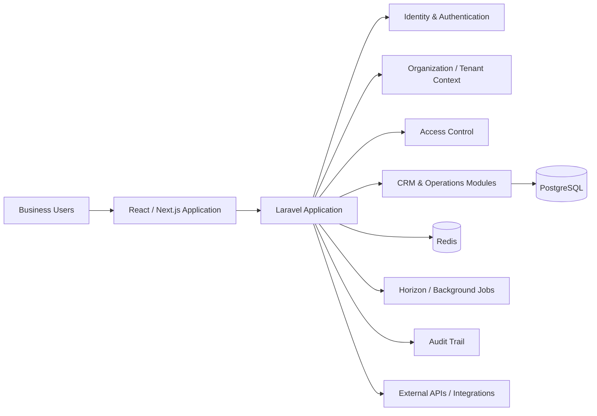

# Manaro CRM — Multi-Tenant Business Operations SaaS

## Overview

Manaro is a CRM and business-operations SaaS platform designed around the day-to-day workflows that connect customers, companies, activities, teams, permissions, and organizational data.

The engineering focus is not only CRUD screens. The product is structured around tenant isolation, role-aware access, auditable business operations, background processing, and a full-stack architecture that can support additional operational modules as the product grows.

## Product Problem

Growing teams often spread customer and operational work across spreadsheets, inboxes, messaging, and disconnected tools. That creates fragmented customer context, inconsistent ownership, weak auditability, and duplicated manual work.

Manaro is designed to bring core business operations into one product with:

- a shared CRM data model
- organization-aware tenant boundaries
- role and permission controls
- traceable activity history
- structured operational workflows
- APIs and background processing for integrations and automation

## Architecture

## Core Capabilities

### CRM Foundation

The CRM domain covers the core entities and interactions required to manage business relationships:

- Contacts
- Companies
- Activities
- relationship and ownership context
- business history and operational follow-up

### Organizations & Tenant Isolation

Business data is designed around organization boundaries so one tenant's records and operational context remain isolated from another's.

### Identity & Access Control

Authentication, organization membership, roles, and permissions are treated as system-level concerns rather than UI-only restrictions.

### Auditability

Important actions can be traced through an audit layer, supporting operational accountability and easier investigation of changes.

### Background Processing

Long-running or asynchronous work can move through Redis-backed queues and Laravel Horizon instead of blocking request/response workflows.

## Engineering Scope

- Multi-tenant SaaS architecture
- Authentication and identity workflows
- Organization and membership modeling
- Role-based access control
- CRM domain modeling
- Contacts, companies, and activities
- Audit trail architecture
- PostgreSQL data design
- Redis-backed background processing
- API and integration readiness
- Containerized local/deployment-oriented environment
- Scheduler and worker processes
- Development mail capture and operational tooling

## Technology

**Backend:** Laravel 12 · PHP 8.3  
**Frontend:** React · TypeScript · Next.js 16  
**Database:** PostgreSQL 16  
**Queue / Cache:** Redis 7 · Laravel Horizon  
**Authentication:** Laravel Fortify  
**Infrastructure:** Docker · Nginx · PHP-FPM  
**Operations:** Scheduler · queue workers · Mailpit

## Engineering Decisions

### Business Workflows Before UI Complexity

The architecture starts from business entities, ownership, permissions, and operational state rather than treating the CRM as a collection of disconnected forms.

### Tenant Isolation Is a Backend Boundary

Organization context belongs in the data and authorization layers. It is not left to frontend filtering.

### Access Control Is Explicit

Permissions are modeled so sensitive business actions can be restricted consistently across application surfaces.

### Auditability Is Part of the Product

Operational history is treated as a first-class system capability, not something added only after an incident or compliance request.

### Asynchronous Work Is Separated

Background jobs and scheduled operations are separated from interactive requests where appropriate, keeping user-facing workflows responsive and easier to operate.

## My Role

My work on Manaro spans:

- Product and technical architecture
- CRM and business-workflow modeling
- Multi-tenant system design
- Identity and access-control architecture
- Backend and database workflow design
- Full-stack implementation direction
- API and integration planning
- Queue, scheduler, and operational architecture
- Testing, debugging, review, and delivery quality
- AI-assisted engineering with human ownership of architecture and technical decisions

## Why This Project Matters

Manaro demonstrates the ability to translate business operations into a structured SaaS product: not only building screens, but designing the data model, permissions, workflows, integrations, and operational foundation behind them.

## Source Code & Privacy

The production source code is maintained privately and is intentionally not published here.

This case study contains only high-level, non-sensitive product and engineering information. It does not expose customer data, credentials, private configuration, internal infrastructure details, or proprietary source code.
