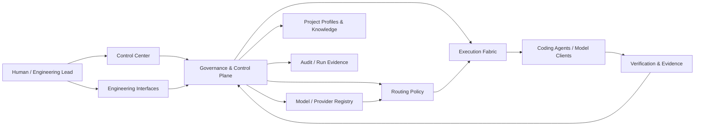

# NewMirac — Governed Multi-Model AI Engineering Platform

## Overview

NewMirac is an AI engineering platform designed to coordinate coding agents, multiple model providers, routing decisions, execution boundaries, and human approval points inside one governed engineering workflow.

The goal is not simply to call different models. The system is designed around a stronger engineering problem: how to use AI agents as productive software-development workers while keeping architecture, authority, cost, verification, and release decisions under explicit control.

## Product Problem

Modern engineering teams can use several AI coding tools and model providers at the same time, but the workflow quickly becomes fragmented:

- different models have different strengths, limits, and costs
- routing decisions are often implicit
- provider qualification and model capability can be difficult to reproduce
- autonomous tools can exceed the authority intended for a task
- engineering evidence, approvals, and execution history can become disconnected
- switching between coding agents can create inconsistent delivery standards

NewMirac treats these as system-design concerns rather than prompt-engineering concerns.

## Engineering Scope

- Multi-model and multi-provider engineering workflows
- Governed routing and provider/model qualification
- Coding-agent orchestration and role-aware execution
- Bounded execution with explicit authority limits
- Human approval boundaries for sensitive or cost-bearing actions
- Model economics and capacity awareness
- Evidence-backed verification and auditability
- Project-specific execution profiles and knowledge context
- MCP and HTTP/JSON control interfaces
- Web-based Control Center for operational visibility and governed actions

## Architecture Highlights

NewMirac is structured around a **governed execution layer** rather than allowing models or coding agents to directly own routing, permissions, or release authority.



### Core architectural principles

- **Routing is governed:** model selection is treated as a policy decision, not an uncontrolled fallback.
- **Authority is bounded:** a worker receives only the context and actions required for the assigned task.
- **Human approval remains explicit:** sensitive activation, paid usage, and other high-impact actions remain behind controlled approval boundaries.
- **Qualification is evidence-based:** model availability does not automatically imply engineering suitability.
- **Execution is observable:** runs, decisions, evidence, and verification are designed to remain inspectable.
- **Reuse comes before reinvention:** existing infrastructure is reused or adapted where it is reliable, while NewMirac-specific governance remains owned by the platform.

## Model & Provider Lifecycle

The platform separates model/provider administration into distinct lifecycle stages rather than treating a configured API key as equivalent to an approved engineering route.

High-level lifecycle:

```text
Discover
   ↓
Register / Propose
   ↓
Qualify
   ↓
Evaluate Capability
   ↓
Human Review
   ↓
Activate for an Approved Scope
   ↓
Observe / Re-evaluate
```

This makes provider onboarding, routing, economics, and capability decisions easier to reason about and audit.

## Cost & Capacity Governance

Model economics are part of the routing and qualification model.

The system distinguishes free, metered, and unresolved economics instead of assuming that an available model is safe to use. Cost-bearing paths can be held behind explicit budget authorization and bounded evaluation rules.

This is particularly important in multi-model systems where several providers may technically satisfy the same task but differ significantly in price, availability, or operational guarantees.

## Engineering Agent Workflow

NewMirac is designed to work with AI coding agents as engineering accelerators while preserving human ownership of:

- architecture
- task decomposition
- model and worker selection
- permissions and execution boundaries
- code review
- testing and verification
- risk decisions
- release quality

The platform includes project-aware workflows so different repositories can operate with their own runtime constraints, verification requirements, skills, and engineering context.

## Control & Integration Surfaces

The platform includes controlled interfaces for interacting with the engine, including:

- a React-based Control Center
- MCP interfaces
- local HTTP/JSON gateway surfaces
- command-line administration and verification workflows
- governed ChatGPT-facing control/read interfaces

These interfaces are intentionally separated from the underlying execution authority.

## Technology

**Core Engine:** Python  
**Control Center:** React · TypeScript · Vite  
**Interfaces:** MCP · HTTP/JSON · CLI  
**AI Engineering:** Multi-model routing · coding agents · tool orchestration · model qualification  
**Operational Concerns:** Governance · verification · audit evidence · cost/capacity controls · bounded execution

## Engineering Decisions

### Governance Before Autonomy

The system does not treat maximum autonomy as the objective. The objective is useful autonomy inside a defined engineering contract.

### Provider-Neutral Design

Provider and model records are treated as replaceable infrastructure. Routing and governance logic remains independent from a single AI vendor.

### Fail-Closed Boundaries

Where evidence, credentials, economics, authority, or verification are insufficient, the intended behavior is to stop or defer rather than silently continue.

### Capability Must Be Demonstrated

A model being reachable is not enough to assign it a critical engineering role. Qualification and capability evidence are separate concerns.

### Human Ownership of High-Impact Decisions

Architecture, approval boundaries, spending authority, activation, and final engineering accountability remain human-owned.

## My Role

My work on NewMirac spans:

- Product concept and technical architecture
- AI-native engineering workflow design
- Multi-model and provider strategy
- Routing and governance design
- Coding-agent orchestration
- Control-plane and execution-boundary design
- Model qualification and evaluation workflows
- Cost and capacity governance
- Control Center and integration direction
- Verification, testing, technical review, and delivery decisions

## Current Development Direction

NewMirac is an actively evolving engineering system. The implemented platform foundation includes governed execution, routing, provider/model administration, project-aware workflows, verification, and control interfaces, while later architecture stages continue to be developed behind explicit implementation and approval gates.

## Source Code & Privacy

The production source code is maintained in a **private repository** and is intentionally not published here.

This case study contains only high-level, non-sensitive product and engineering information. It does not expose credentials, private infrastructure, internal configuration, proprietary implementation code, or project secrets.
