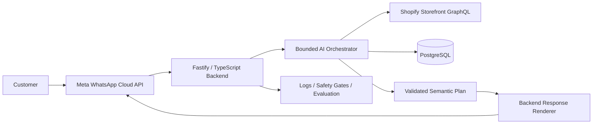

# Pawkenz AI Commerce Agent — Grounded WhatsApp Commerce Assistant

## Overview

Pawkenz AI Commerce Agent is an applied AI commerce system designed for a Shopify-based pet-products business. The product goal is to let customers discover products, check grounded price and availability information, and progress toward cart and checkout workflows through WhatsApp while preserving strict control over what the AI is allowed to say and do.

The assistant is designed for Egyptian Arabic, Modern Standard Arabic, English, and mixed Arabic-English customer conversations.

## Product Problem

Commerce assistants become risky when the language model is allowed to invent product facts, prices, availability, discounts, or unsupported recommendations.

A customer-facing agent needs to solve several problems at the same time:

- understand natural-language product requests
- retrieve current commerce data from Shopify
- avoid hallucinating price, stock, or product details
- handle ambiguous product selection safely
- support multilingual customer language
- integrate with WhatsApp
- preserve safe boundaries around cart and checkout mutations
- remain testable without requiring live provider calls for every engineering change

The system was designed around **grounded commerce behavior** rather than unrestricted conversational generation.

## Architecture

## Core Engineering Principle

The model does **not** directly own the final customer response.

Instead, the AI selects a bounded semantic plan containing approved intents, language choices, and evidence references. The backend validates that plan and renders the final customer-facing text from approved phrases and current-turn evidence.

This creates a stronger separation between:

**Reasoning:** what the customer is asking for and what action is appropriate.

**Facts:** current product, price, and availability data retrieved from trusted tools.

**Rendering:** the exact response that is allowed to reach the customer.

## Grounded Commerce Tools

The orchestration layer uses explicit commerce tools instead of relying on model memory:

- **Product Search** — discovers candidate products from the Shopify catalog
- **Product Details** — retrieves the selected product by its exact identifier
- **Price & Availability** — retrieves current commerce facts for the active customer turn
- **Cart Workflow** — controlled cart behavior developed behind mutation safety gates

Current-turn provenance is retained so customer-facing claims can be tied back to the exact tool evidence used during that turn.

## Safety & Reliability Design

### Backend-Controlled Response Rendering

The model selects from a closed semantic plan; the backend renders the final customer response. This reduces the risk of unsupported commercial claims.

### Product Ambiguity Lock

If product search returns an ambiguous result, the system asks the customer to clarify rather than silently selecting a candidate and retrieving potentially incorrect pricing.

### Grounded Availability

Availability is derived from Shopify commerce signals in backend logic rather than being inferred by the model. Quantity and restock claims remain unavailable unless the required evidence exists.

### Fail-Closed Runtime Modes

The runtime is intentionally separated into controlled modes. Provider-facing behavior remains disabled unless the correct mode and required configuration are explicitly supplied.

### Mutation Safety

Cart and checkout paths are treated differently from read-only catalog access. Commerce mutations remain behind explicit development and production safety boundaries.

## Multilingual Customer Experience

The assistant mirrors the language family of the current customer message and supports:

- Egyptian Arabic
- Modern Standard Arabic
- English
- mixed Arabic-English

Language handling is treated as product behavior rather than free-form generation so commercial facts remain consistent across language variants.

## WhatsApp Integration

The system includes a Meta WhatsApp Cloud API adapter and webhook workflow.

Development validation has included controlled provider-side testing and webhook verification, while production customer messaging remains intentionally separate from those developer tests.

No claim is made here that the AI agent is deployed to real customers.

## Evaluation Strategy

The project separates live provider validation from deterministic engineering tests.

**Offline evaluation** uses fake provider transports and zero network calls so orchestration behavior can be tested repeatedly.

**Controlled developer smoke tests** are used selectively to validate real provider integration paths such as OpenAI, Shopify, and WhatsApp.

This makes it possible to test behavior without turning every CI run into an external AI or commerce request.

## Technology

**Backend:** Node.js 24 · TypeScript · Fastify  
**Validation:** Zod  
**AI:** OpenAI Responses API · function/tool calling · bounded orchestration  
**Commerce:** Shopify Storefront GraphQL  
**Messaging:** Meta WhatsApp Cloud API  
**Data:** PostgreSQL  
**Testing:** Vitest · deterministic offline evaluations  
**Infrastructure:** Docker-oriented runtime · local controlled provider testing

Provider integrations use native HTTP/fetch boundaries rather than requiring provider SDKs in the product path.

## Engineering Decisions

### Grounding Over Fluency

A commercially safe answer is more important than a more creative answer. Unsupported product facts are withheld rather than guessed.

### Model Plans, Backend Speaks

The language model contributes intent and semantic selection while the application owns final rendering and policy enforcement.

### Read and Mutation Paths Are Separate

Searching a catalog is not treated as equivalent to changing a cart. Mutation-capable workflows receive stricter controls and validation.

### Offline Tests Are First-Class Evidence

The orchestration layer is designed so important behavior can be evaluated deterministically without live API calls.

### No Hidden Production Claims

Developer validation, local runtime tests, provider verification, and production deployment are treated as different states. A successful developer smoke test is not described as a production launch.

## My Role

My work on the project spans:

- Product and technical architecture
- AI agent workflow design
- Grounding and response-safety strategy
- Tool and orchestration boundaries
- Shopify integration architecture
- WhatsApp integration direction
- Backend workflow and data design
- Evaluation, verification, and release-quality decisions
- AI-assisted engineering with human ownership of architecture and review

## Current State

The engineering foundation includes the backend, Shopify catalog tools, AI orchestration, grounded response rendering, offline evaluation, PostgreSQL support, cart workflow development, and WhatsApp integration work.

The system remains intentionally conservative about production readiness: customer-facing production deployment is kept separate from controlled developer validation.

## Source Code & Privacy

The production source code is maintained in a **private repository** and is intentionally not published here.

This case study contains only high-level, non-sensitive product and engineering information. It does not expose credentials, customer data, private infrastructure, internal configuration, or proprietary implementation code.
