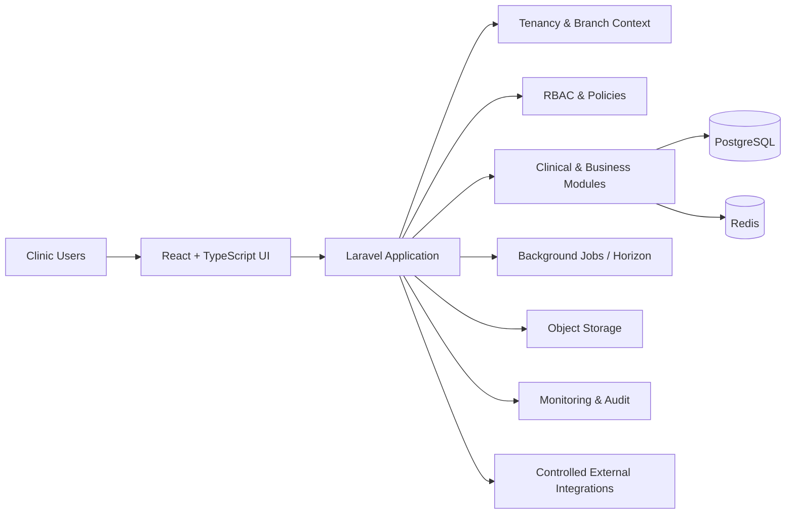

# QlinicPro — Multi-Tenant Veterinary Clinic SaaS

[Live Demo](https://demo.qlinic.tech/)

## Overview

QlinicPro is a multi-tenant veterinary clinic SaaS platform designed to centralize day-to-day clinic operations in one system while keeping clinic data isolated, access controlled, and operational workflows maintainable as the product grows.

The platform combines clinical operations, administrative workflows, billing, inventory, and role-based experiences within a modular full-stack architecture.

## Product Problem

Veterinary clinics often operate across disconnected tools, spreadsheets, messaging, and manual processes. That creates duplicated work, fragmented records, inconsistent permissions, and limited visibility across clinic operations.

QlinicPro was designed around a single operational platform with clear tenant boundaries, role-specific workflows, and a technical foundation that can evolve without turning the application into a tightly coupled monolith.

## Engineering Scope

- Multi-tenant SaaS architecture with strict clinic-level data isolation
- Multi-branch support for branch-aware workflows
- Role-based access control and policy-driven authorization
- Client, pet, appointment, visit, prescription, billing, and inventory workflows
- Background processing and caching
- Auditability for critical actions and workflow transitions
- API and third-party integration readiness
- Production-oriented deployment, monitoring, storage, and operational tooling

## Architecture Highlights

QlinicPro uses a **modular monolith** approach: the system remains operationally simple to deploy while domain boundaries are kept explicit inside the application.

### Key architectural principles

- Every tenant-owned record is scoped to a clinic tenant.
- Branch-aware records remain bound to the correct operational branch.
- Authorization is enforced server-side through roles, permissions, and policies.
- Financial calculations and critical state transitions are validated on the backend.
- Background jobs are used for work that should not block request/response flows.
- Audit logging is treated as part of the product architecture rather than an afterthought.

## Core Capabilities

**Clinic Operations**  
Clients, pets, appointments, visits, prescriptions, clinical workflows, and role-specific dashboards.

**Business Operations**  
Invoices, payments, reporting-oriented data flows, and inventory management.

**Access & Isolation**  
Multi-tenant isolation, multi-branch context, RBAC, policies, and separate experiences for administrative, clinical, reception, and client-facing roles.

**Operational Reliability**  
Redis-backed queues and caching, audit trails, monitoring, backup/recovery planning, and deployment runbooks.

## Technology

**Backend:** Laravel 12 · PHP 8.3+  
**Frontend:** React · TypeScript · Inertia.js · Tailwind CSS  
**Database:** PostgreSQL  
**Queue / Cache:** Redis · Laravel Horizon  
**Authorization:** Laravel Policies · Spatie Laravel Permission  
**Storage:** S3-compatible object storage  
**Infrastructure:** Nginx · Supervisor · Docker / Linux-oriented deployment workflows  
**Observability:** Application monitoring · uptime monitoring · audit logs

## Engineering Decisions

### Modular Monolith over Premature Microservices

The architecture keeps deployment and operations straightforward while still enforcing module boundaries and domain separation. This provides room to scale the engineering structure without introducing distributed-system complexity before it is justified.

### Tenant Isolation as a System Invariant

Multi-tenancy is not handled only at the UI layer. Tenant and branch context are enforced throughout the data model and authorization boundaries so one clinic cannot access another clinic's data.

### Server-Side Trust Boundaries

Sensitive calculations, permissions, workflow transitions, and critical business rules are enforced on the backend rather than trusting frontend state.

### Operational Quality

Testing, deployment readiness, monitoring, backup/recovery planning, and auditability are treated as part of delivery quality, not as optional post-launch work.

## My Role

My work on QlinicPro spans:

- Product and technical architecture
- Full-stack system design and implementation
- Multi-tenant and RBAC architecture
- Database and backend workflow design
- Frontend product workflows
- Integration architecture
- Engineering quality, testing, debugging, and release readiness
- AI-assisted engineering workflows with human ownership of architecture, review, and delivery decisions

## Source Code & Privacy

The production source code is maintained in a **private repository** and is intentionally not published here.

This case study contains only non-sensitive, high-level product and engineering information. It does not expose credentials, private implementation details, customer data, internal configuration, or proprietary source code.
